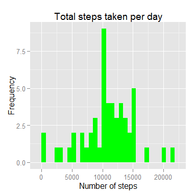
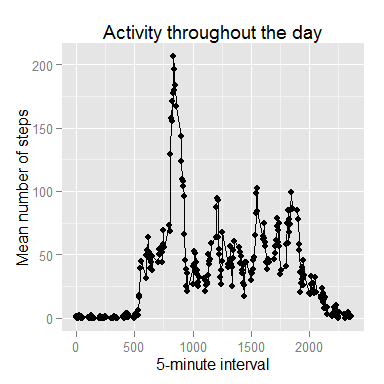
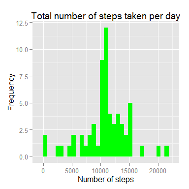
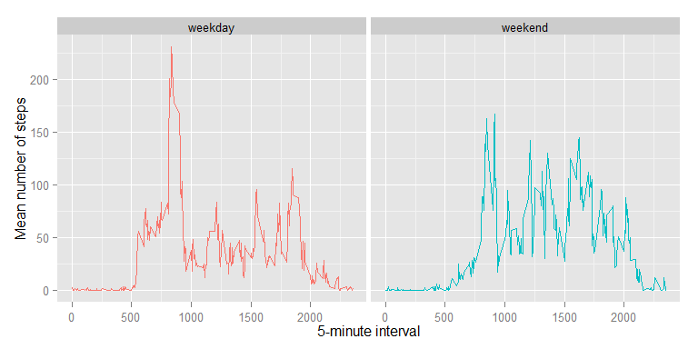

# Reproducible Research: Peer Assessment 1


Before starting any analysis we load any needed libraries and set the working directory.


```r
  library(ggplot2)
  library(dplyr)
  library(lubridate)

  setwd("C:/Users/linus/r_repos/RepData_PeerAssessment1")
```
### Loading and preprocessing the data

The first step in the analysis is to read the data from the source file, and do any processing required. Here the class of the date variable is changed from 'factor' to 'Date'. The data is also saved as a dplyr data frame tbl for efficient use with dplyr functions.


```r
  data.df <-read.csv("activity.csv")

  data.df$date <- as.Date(data.df$date)  
 
  data.tbl <- tbl_df(data.df)
```

### What is mean total number of steps taken per day?

The total number of steps taken each day can be calculated using the the group_by() and summarise() functions in the dplyr package. The results are saved in a new data frame with a variable total for each date.


```r
  total_by_day.tbl <- data.tbl %>% 
    group_by(date) %>%
    summarise(total = sum(steps))
```

An easy way to get an idea of how the number of steps varies between days is to plot a histogram of the total number of steps per day.


```r
          fig1 <- ggplot(total_by_day.tbl, aes(x=total)) + geom_histogram(fill="Green")
          fig1 <- fig1 + labs(x ="Number of steps", y = "Frequency", title="Total steps taken per day")
          fig1 <- fig1 + theme(legend.position="none")
          fig1    
```

 

This shows that the number of steps varies significantly between days, but that most days are spread around the middle of the distribution. There are also a couple of days for which the number of steps are equal to, or close to zero. In a more thourough analysis it would be worth having a closer look at these.

More information about the data can also be gained from calculating some summary statistics. 


```r
          sumstats <- total_by_day.tbl %>%
            summarise(mean(total, na.rm=TRUE), median(total, na.rm=TRUE))

        # Mean and median are printed below using inline code 'r ...'
```

In our data set, the mean number of steps per day is 10766 and the median is 10765. That the mean and median are very similar confirms the conclusion from the graphical analysis that most days are located close to the middle of the distribution.

### What is the average daily activity pattern?

The analysis above focused on differences in the number of steps taken across days. The available data can also be used to look at how the number of steps varies througout the day. For this purpose, we can calculate the mean number of steps for each 5-minute interval (across all days).


```r
        mean_by_interval.tbl <- data.tbl %>% 
            group_by(interval) %>%
            summarise(meansteps = mean(steps, na.rm=TRUE))
```


```r
          fig2 <- ggplot(mean_by_interval.tbl, aes(x=interval, y=meansteps)) + geom_point(fill="Green")
          fig2 <- fig2 + geom_line()
          fig2 <- fig2 + labs(x ="5-minute interval", y = "Mean number of steps", title="Activity throughout the day")
          fig2 <- fig2 + theme(legend.position="none")
          fig2    
```

 

Plotting the mean number of steps by 5-minute interval reveals a number of facts about how movements are distributed during the day. First of all, there are very few steps before 5am in the morning and in the last two hours or so before midnight, when most people are probably in bed.

There is also a peak in activity in the morning, around the time when most people would be leaving for work. There is a second peak in activity around lunch time. 


```r
        # Find the interval with the highest mean number of steps across all days
        maxinterval <- mean_by_interval.tbl %>%
                arrange(meansteps) %>%
                      tail(1)

        # Information about interval with maximum steps is printed below using inline code 'r ...'
```

The 5-minute interval with the higest mean number of steps across all days is that starting at 835 with 206.2 steps, consistent with the peak in the morning seen in the figure above.

### Imputing missing values

In the analysis above, any problem with missing values were ignored. However, missing values can impact the analysis significantly. First we have a look at how much of a problem missing values is in the current data set, and a simple imputation procedure is then implemented.


```r
        missingvalues <- sum(is.na(data.tbl$steps))
        percentmissing <- missingvalues/nrow(data.tbl)*100

        # Number and percent of missing observations are printed below using inline code 'r ...'
```

There are 2304 missing observations in this data set, or 13.1 per cent of the total number of observations.

One approach to reduce the impact of missing observations is by imputing values. Here, the approach used is to set missing observations equal to the mean number of steps for that interval in the actual data (across all days).


```r
        # Create a copy of the data set with
        dataimputed.tbl <- select(data.tbl, steps, date, interval)
        # Change all NA values (missing observations) to mean for interval
        dataimputed.tbl[is.na(data.tbl$steps),1] <- mean_by_interval.tbl[mean_by_interval.tbl$interval %in% dataimputed.tbl$interval, 2]
```

The effect of the imputation can be analysed by repeating the above analysis, but with the new data set. First the total for each day is re-calculated, and then the plot and summary statistics presented above a replicated using the new data.


```r
         total_by_day_imputed.tbl <- dataimputed.tbl %>% 
            group_by(date) %>%
            summarise(total = sum(steps, na.rm=TRUE))
```


```r
          fig3 <- ggplot(total_by_day_imputed.tbl, aes(x=total)) + geom_histogram(fill="Green")
          fig3 <- fig3 + labs(x ="Number of steps", y = "Frequency", title="Total number of steps taken per day")
          fig3 <- fig3 + theme(legend.position="none")
          fig3    
```

 

The imputation only has one effect on the histogram, making the bar containing the mean total steps per day value larger (now the tallest bar). This is because all the days for which values were imputed now have the mean number of total steps taken.


```r
        sumstatsimputed <- total_by_day_imputed.tbl %>%
            summarise(mean(total, na.rm=TRUE), median(total, na.rm=TRUE))

        # Mean and median are printed below using inline code 'r ...'
```

The mean number of steps taken in the data set with imputed values is 10766, and the median is 10766.

The imputation didn't change the mean number of steps taken daily (because all imputed days are identical to the mean day in the original data). The median has increased by one step, consistent with the imputed days having a value that is one higher than the median in the original data. 

### Are there differences in activity patterns between weekdays and weekends?

After having looked at differences across all days and differences within days, it is also interesting to see how the movements throughout the day varies between days. Rather than compare all days, we can analyse weekdays and weekends separately. 

This requires creating a factor variable with information about whether any specific observation is on a weekday or weekend. Using this new variable, we can then calculate the mean number of steps taken in each 5-minute interval separately for weekdays and weekends.


```r
        # Get list of days in data set
        weekdays <- wday(dataimputed.tbl$date, label=TRUE)
        # Set up variable equal to 'weekday' for all days, and then change it 'weekend' for Sundays and Saturdays
        typeofday <- rep("weekday", length(weekdays))
        typeofday[weekdays=="Sun" | weekdays=="Sat"] <- "weekend"
        
        # Add new variable to data tbl as factor
        dataimputed.tbl <- mutate(dataimputed.tbl, type=factor(typeofday))

        # Calculate mean number of steps for each interval with the imputed data
        mean_by_interval_imputed.tbl <- dataimputed.tbl %>% 
            group_by(interval, type) %>%
            summarise(meansteps = mean(steps, na.rm=TRUE))
```


```r
        fig4 <- ggplot(mean_by_interval_imputed.tbl, aes(x=interval, y=meansteps, col=type)) + geom_line()
        fig4 <- fig4 + facet_grid(. ~ type)
        fig4 <- fig4 + labs(x ="5-minute interval", y = "Mean number of steps")
        fig4 <- fig4 + theme(legend.position="none")
        fig4
```

 

The plot above shows that there are some important differences between weekdays and weekdays. Interestingly, steps are more evenly distributed throughout the day on weekends. The peak in the number of steps in the morning is less pronounced, although it still exists. Activity in the morning also increases more gradually on weekends.
